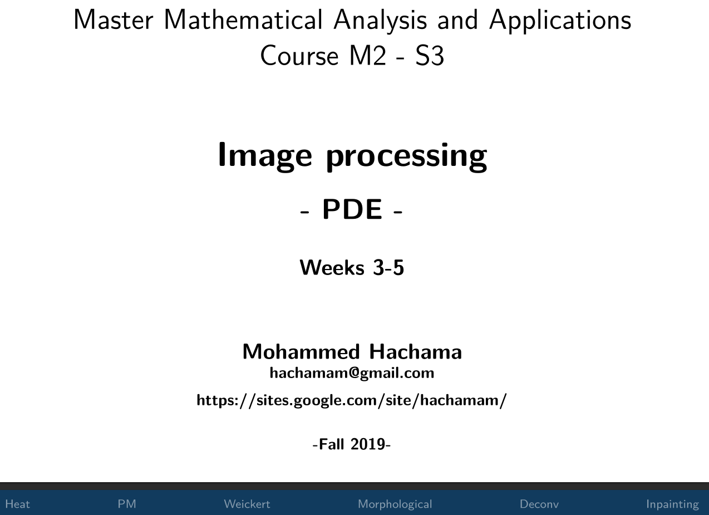
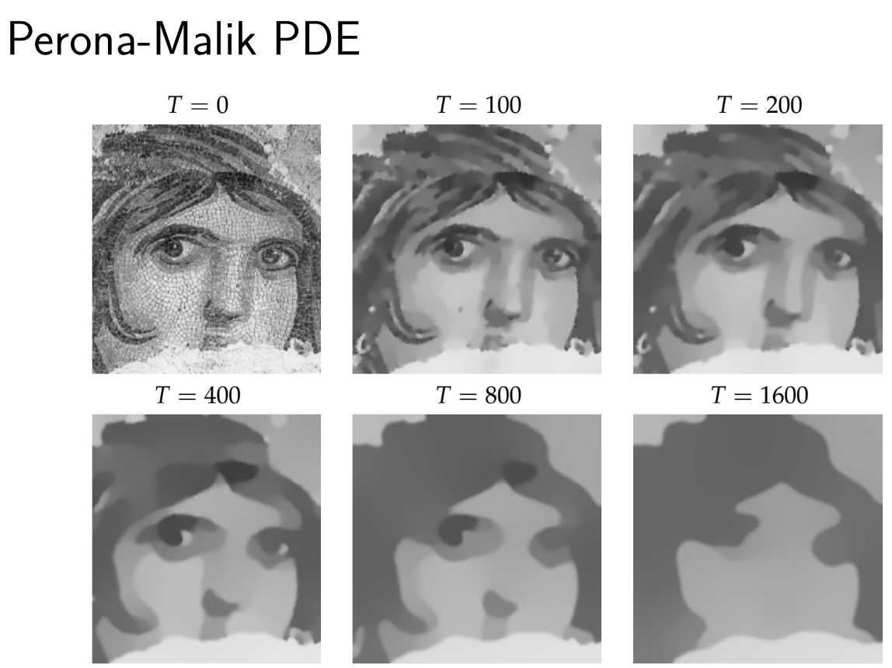
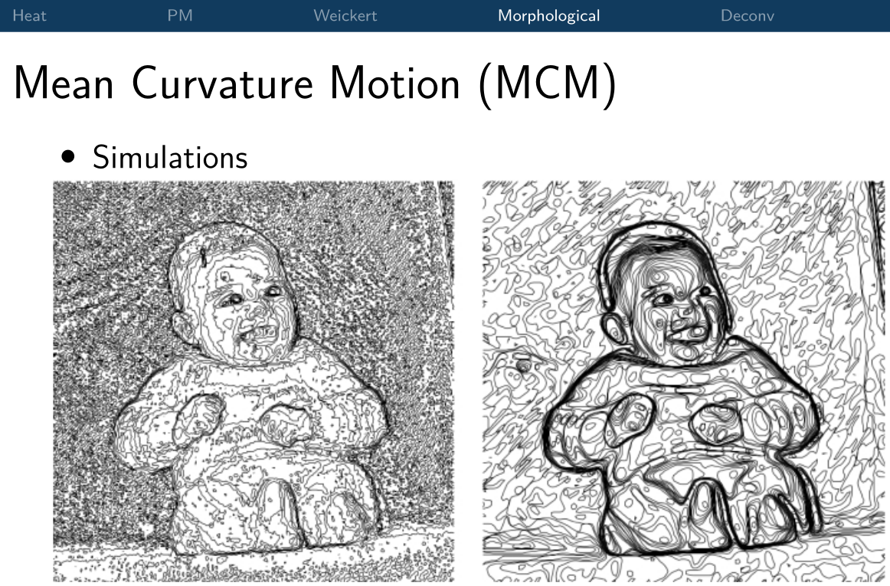
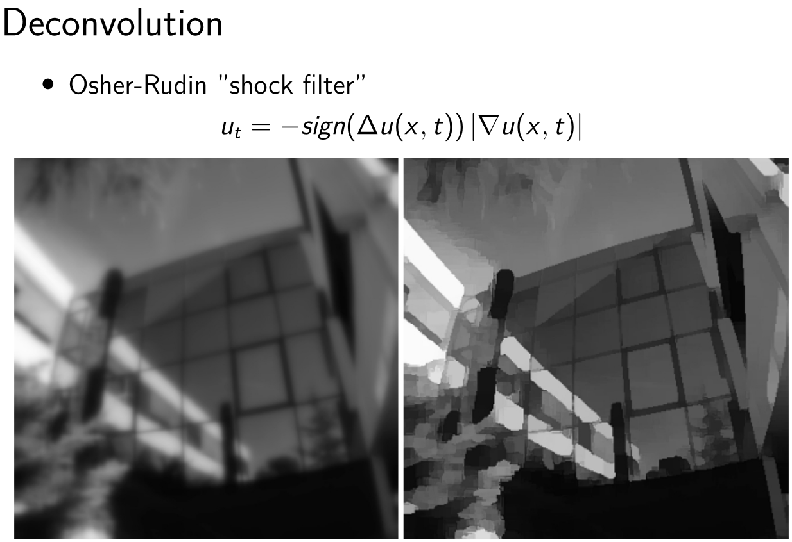

 

|---------+------------------------------------------------+--------------------------+------------+----------------------+------------------------------------------------------------|
| Week    |          Chapter                               | Slides/Scribes           | Notebooks  |  Exercices           |    Video lectures                                          |
|:-------:|:----------------------------------------------:|:------------------------:|:----------:|:--------------------:|:----------------------------------------------------------:|
|   1     | Introduction                                   | [Slides 1](slides#pde)   |            |                      |                                                            |
|=========+================================================+==========================+============+======================+============================================================|
|:-------:|:----------------------------------------------:|:------------------------:|:----------:|:--------------------:|:----------------------------------------------------------:|
|  2      | PDEs for Image restoration (1/4)               | [Slides 2](slides#pde1_2)|      -     |  [TD 1](td/TD1.pdf)  |      |    
|:-------:|:----------------------------------------------:|:------------------------:|:----------:|:--------------------:|:----------------------------------------------------------:|
|  3      | PDEs for Image restoration (2/4)               | [Slides 2](slides#pde1_2)|      -     |                      |        |    
|:-------:|:----------------------------------------------:|:------------------------:|:----------:|:--------------------:|:----------------------------------------------------------:|
|  4      | PDEs for Image restoration (3/4)  Part A       | [Slides 3](slides#pde1_2)|      -     |           -          | |    
|:-------:|:----------------------------------------------:|:------------------------:|:----------:|:--------------------:|:----------------------------------------------------------:|
|         | PDEs for Image restoration (3/4)  Part B       | [Slides 3](slides#pde1_2)|      -     |           -          | |    
|:-------:|:----------------------------------------------:|:------------------------:|:----------:|:--------------------:|:----------------------------------------------------------:|
|  5      | PDEs for Image Inpainting  (4/4) Part A        | [Slides 3](slides#pde1_2)|      -     |           -          | |    
|:-------:|:----------------------------------------------:|:------------------------:|:----------:|:--------------------:|:----------------------------------------------------------:|
|         | PDEs for Image restoration (4/4) Part B        | [Slides 3](slides#pde1_2)|      -     |           -          | |    
|=========+================================================+==========================+============+============+======================================================================|

<!-- 

|---------+------------------------------------------------+--------------------------+------------+----------------------+--------------------------|
| Week    |          Chapter                               | Slides/Scribes           | Notebooks  |  Exercices           |    Video lectures        |
|:-------:|:----------------------------------------------:|:------------------------:|:----------:|:--------------------:|:------------------------:|
|   1     | Introduction                                   |             -            |            |                      |                          |
|=========+================================================+==========================+============+======================+==========================|
|:-------:|:----------------------------------------------:|:------------------------:|:----------:|:--------------------:|:------------------------:|
|  2,3    | PDEs (1/2)                                     | [Slides 2](slides#)      |      -     |  [TD 1](td/TD1.pdf)  |    |      
|:-------:|:----------------------------------------------:|:------------------------:|:----------:|:--------------------:|:----------:|
|:-------:|:----------------------------------------------:|:------------------------:|:----------:|:----------:|:----------:|
|  4,5,6  | PDEs (2/2): Image restoration                  | [Slides 3](slides#)      |      -     |            |            |
|=========+================================================+==========================+============+============+============|
|   7     | Variational calculus (1/2)                     | [Slides 4](slides#)      |      -     |            |            |
|:-------:|:----------------------------------------------:|:------------------------:|:----------:|:----------:|:----------:|
|  8,9-10 | Variational calculus (2/2): Image restoration  | [Slides 5](slides#)      |      -     |            |            |
|=========+================================================+==========================+============+============+============|
| 11-12   | Image segmentation                             | [Slides 6](slides#)      |      -     |            |            |
|=========+================================================+==========================+============+============+============|

|---------+------------------------------------------------+--------------------------+------------+------------|
| Week    |          Chapter                               | Slides/Scribes           | Notebooks  |  Exercices |
|:-------:|:----------------------------------------------:|:------------------------:|:----------:|:----------:|
|   1     | Introduction                                   | [Slides 1](slides#intro) |      -     | [TD 1](td/TD1.pdf)|
|=========+================================================+==========================+============+============|
|:-------:|:----------------------------------------------:|:------------------------:|:----------:|:----------:|
|  2-3    | Mathematical tools                             | [Slides 2](slides#)      |      -     | [TD 2](td/TD2.pdf)|
|:-------:|:----------------------------------------------:|:------------------------:|:----------:|:----------:|
|  4-5    | PDEs (1/2)                                     | [Slides 3](slides#)      |      -     |            |
|:-------:|:----------------------------------------------:|:------------------------:|:----------:|:----------:|
|  6-7    | PDEs (2/2): Image restoration                  | [Slides 4](slides#)      |      -     |            |
|=========+================================================+==========================+============+============|
|   8     | Variational calculus (1/2)                     | [Slides 5](slides#)      |      -     |            |
|:-------:|:----------------------------------------------:|:------------------------:|:----------:|:----------:|
|  9-10   | Variational calculus (2/2): Image restoration  | [Slides 6](slides#)      |      -     |            |
|=========+================================================+==========================+============+============|
| 11-12   | Image segmentation                             | [Slides 8](slides#)      |      -     |            |
|=========+================================================+==========================+============+============| -->
